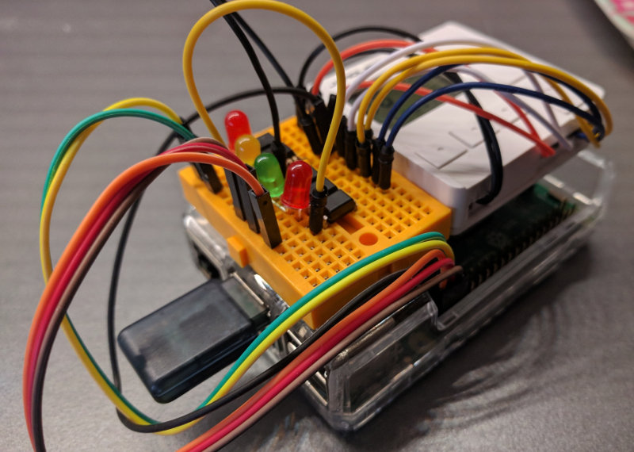
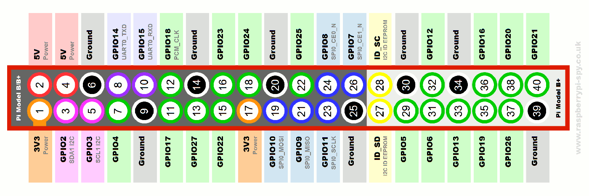

# Pi remote shutter controller interface
Hack for your home shutter remote control, compatible with **Raspberry GPIOs** outputs.
This program will **run a web server** enabling to interface the remote with your domotic environment.

***Why this project?** Some manufacturers does not allow you to control you shutters using 
your own RF antenna, they user an hardware encryption when pairing.
You don't give up and want to link your remote controller with your Raspberry ;)*

Here is an example of pi remote:




## Select and `open` / `close` / `stop` shutters
Use those function using the following url

To open rolling shutter on channel 1 *(set 1 if you've only one channel)*:
```curl
http://localhost:8086/1/open
```

To stop the shutter on **channel 1 and 2**:
```curl
http://localhost:8086/1,2/stop
```

To **close half way** all your shutters above 4:
```curl
http://localhost:8086/1,2,3,4/-0.5
```

To **open a little bit more** (10%) your shutter 1:
```curl
http://localhost:8086/1/0.1
```


### Set up

- [x] Install `nodejs` and `npm` on your Raspberry.
- [x] Clone project and edit the JSON configuration `config.js` to match your controller
- [x] Run this program as a cron


```bash
# In project folder
npm install
node ./index # works with absolute paths
```

You have to run this program **on system start up**,
you can use `supervisord` for this or create an `/etc/init.d/` daemon.

Here is my supervisord configuration for that `/etc/supervisor/conf.d/shutters.conf`:
```
[program:shutters]
command=node /path/to/project/index.js
autostart=true
```


## Channel configuration
If you have a controller with multiple channels, it is necessary to link **at least one button** on the Raspberry:
- the next channel (`next` button) to increment channel pointer
- the previous channel (`prev` button) to decrement channel pointer

The prev button is optional and depends of your controller, set `config.gpio.prev: false` to disable the *prev* button.

Program is compatible with unique channel, just call `/1/stop`

To avoid a desynchronization of the remote / PI as there are no input, 
an idle state is triggered after a few seconds and reset to the default channel 1.


## Example of hacked remote controller
I tested this program to control Jarolift shutters with a **Jarolift `TDRC-08W`** controller (8 channels), 
for which I solded wires and connected them to an easy breadboard.

Every buttons need two wires, and are connected to an **optocoupler**.
The optocoupler is linked from the GPIO to the ground of the Raspberry.
You can use also transistors with adequate resistors, but an optocoupler don't need any thinking as 
the remote voltage and intensity is really low.


```
                    GND      PI-GPIO
                   +-[x]---[x]-+
                   |  ┃     ┃  |
                   |  ┗━|◀|━┛  |
                   |     🡗🡗    |
                   |    ____   |
                   |   🡗    \  |
                   +-[x]---[x]-+
                    remote button
```


You can use the GPIO of the Raspberry you want, set those in the configuration:


